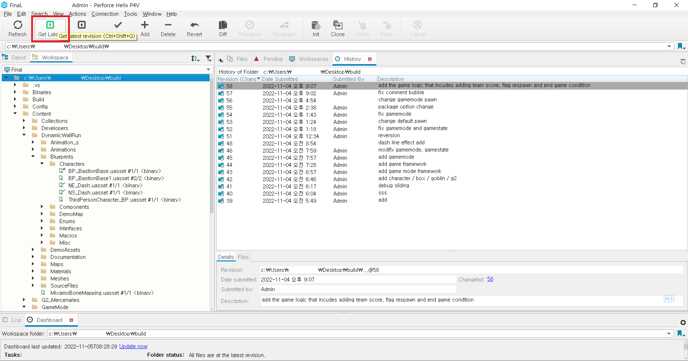
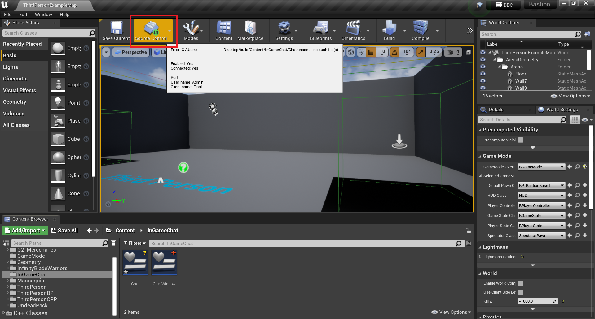
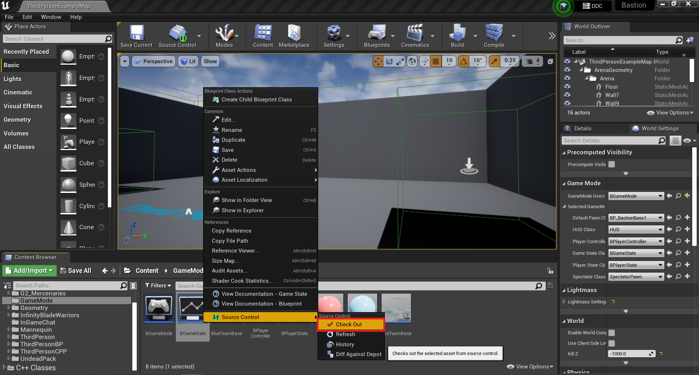
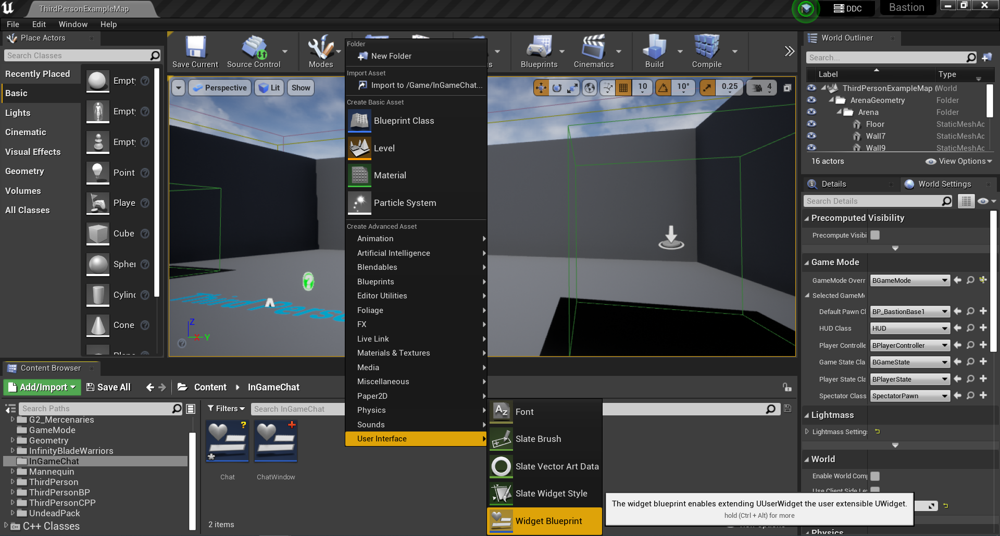
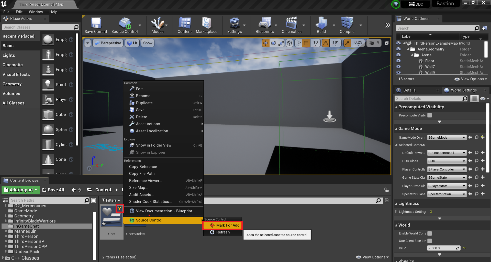

간편 언리얼에서 퍼포스 사용법
******
1. 퍼포스에서 최신 리비전을 가져온다.

***
2. 언리얼에서 소스컨트롤과 연결한다.

***
3. 기존에 작업하던 컨텐츠인 경우 내가 수정하기 위해서 체크아웃을 한다. 워크스페이스에서 필요한 컨텐츠만 퍼포스에 올리겠다는 의미

***
4. 새로 만들 경우는 추가하고

***
5. 마크해서 퍼포스가 알 수 있게 한다.

***
6. 작업이 다 끝난다면 퍼포스에 제출!

***